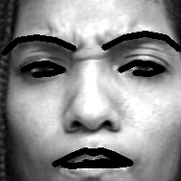
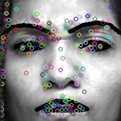
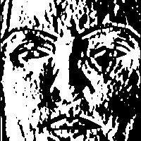
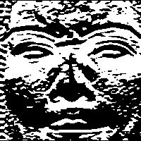
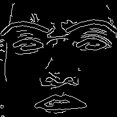
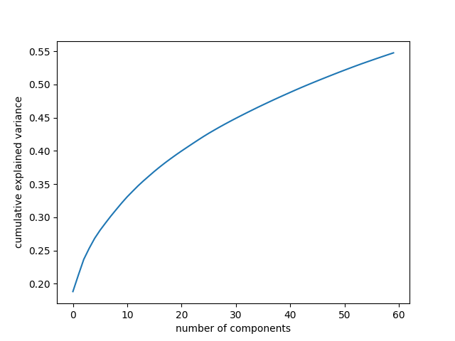
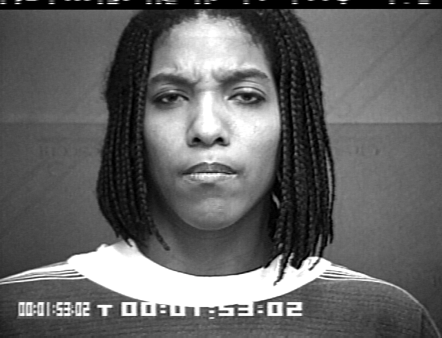

# Sentiment-Detection-by-Human-face

The purpose of this project is to use supervised learning to detect sentiment in human faces. This could be used for smart human-computer interaction, such as lie detection, or adding an emotion tag to a movie or video. Most of the research we found in this area uses deep learning, especially the most recent work. The newest research paper we found on the topic that does not use deep learning is from 2008. Our plan was to not use deep learning and see how well our model performs compared to state of the art deep learning models. 
According to the trained model, we can detect 7 different emotions (1=anger, 2=contempt, 3=disgust, 4=fear, 5=happy, 6=sadness, 7=surprise) according to any given frontal view. In this project, we excluded 0 - neutral. 
Three major parts of this project are human face detection, feature extraction and model design. Human face detection is finding the position of face in a given picture; feature extraction is reducing the noise in the cropped face picture and keeping major features; model design is discovering a proper model, training and evaluating it. The packages or technologies facilitating this project are listed in **Table 1**.

| **Section** | **Package** | **Description** |
| --- | --- | --- |
| Data Preparation | oversample sklearn | Frame forward StratifiedShuffleSplit |
| Face detection | OpenCV dlib | Facedetect Draw face basic features |
| Feature extraction | SIFT Gradient Canny | Difference of GaussianGradient by orientationsOutline of objects |
| Modeling | sklearn | SVM MLP PCA |
Table 1 - a brief description of packages or technologies in sentiment detection

The datasource is from Extended Cohn-Kanade (CK+) database. All sequences are from the neutral face to the peak expression. Thus, it captures 593 peak expression frame across 123 subjects, and classify to 8 emotions. See Figure 1. But only 327 of the 593 sequences have marked classification labels. This is because these are the only ones the fit the prototypic definition.
## File explaination
| **File name**| **DESC** |
| --- | --- |
| sentimentclassfication.py | face detection, feature extration, model training |
| image-detection.py | Test from a given image with hyperlink or local image |
| facedetection.py | camera capture |
| face_enum.py | enum class |
| config.ini | config temp files or persistance file for model |

## Algorithms Used
### Human face detection
A trained human face library in OpenCV has been used to find the position and width and height of the face in the samples. To more focus on face, we squeeze 15% size of width and height respectively, then compress to 200*200 pixels gray picture( the color channels are useless for sentiment detection). According to Figure 2, we can find the major expressions have been captured, and cropped ears and mostly hair out of the frame. 

Figure 2 - face detection and crop in the gray channel
    
Before stepping into feature extraction, another more accurate face detection called dlib, has been used to find detail 68 points on the face, such as eyebrow, eyes, nose, mouth, nose, and jawline. In this project, we connected all points except ones on nose and jawline. Figure 3. 

Figure 3 - with connected points, we can find different shapes under different emotions.

### Feature extraction
After the face detection, we tried to do the feature extraction with four different ways:
SIFT
SIFT use difference of Gaussian to detect the object features. We can find the small circles has capture some important information, such as frown and edge of nose. See Figure 4.

Figure 4 - feature extraction with SIFT

Gradient
Gradient is a directional change in intensity or color of image. Here we use gray image,    so we should find the intensity change with different orientations. Figure 5 shows how gradient works in X axis and Y axis. We can find X axis is better than Y axis.

Figure 5 - feature extraction with gradient by x, y axis respectively

Canny
Canny is used to find edge of picture. Figure 6 shows how it works.

Figure 6 - feature extraction with drawing outline
    
After feature extraction, the images have been normalized and saved in a matrix with its corresponding label. Then the matrix is persistent into two npy files, called x.npy and y.npy. Thus, we don’t have to pre-process image when training model. 

### Model design
Since there are 200*200*327=13,080,000 pixels totally and unknown noise in the pre-processed images, PCA was executed to figure out major components. Figure 7 shows 55% information can be explained when reaching to 60 components with gradient feature extraction(other feature extraction functions grained similar results). So, we chose first 60 components as inputs for training and validation.  

Figure 7 - PCA plot
In the source database, only the last frame was labeled( total 327 frames). Lack of samples will easily lead to overfitting or bad performance in the generalization. To solve this problem,  we pick up not only the last frame denoted as i, but also i -2, i - 4 frames in the same series( a series is from neutral to peak expression in one subject). Figure 8 show the few changes in these three images. 

Figure 8 frown and mouth shape changes in these three images

To keep balance of training samples,     stratified shuffle Split is executed which split samples into train and validation groups by label field. It guaranteed each classification has been trained in the model.
After all above steps, we construct two models: MLP and SVM. Both of them work well in the field of classification. The detail of tuning can be found in performance section.

